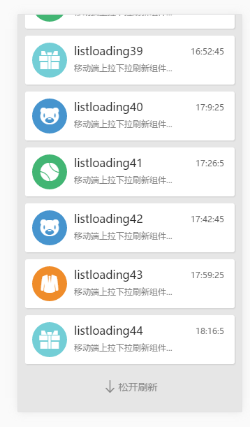

# listloading.js 
listloading是一个移动端的上拉、下拉加载更多的组件。主要依赖于iscroll.js v5.1.2基础上开发的组件，基础库可以使用jquery.js或者zepto.js操作dom节点，目前我是使用了zepto.js作为基础库操作dom，以jquery插件的形式存在。如果不想以插件方式使用，则只需要把listloading直接移植你需要的库里面就ok啦。listloading主要针对移动端而生，在使用浏览器自带滚动，用户体验很不友好，与Android和ios差别甚远，所以选择iscroll.js，它实现方式是使用css3动画translate 2D 转换来实现滚动效果，transform属性使用硬件加速，性能方法得到很大提高。

###npm安装
```javascript
npm install -g listloading
```


## 使用方法如下：

###1、html结构
```html
<div id="listloading">
    <div>
        <ul id="order-list"></ul>
    </div>
</div>
```
与iscroll创建的结构一样，但是指定的创建的元素节点必须指定ID，因为在组件里面发布订阅模式需要做一个标识。因为iscroll在节点元素创建之前，必须先设定高度，否则会导致无法滚动；iscroll创建完毕是指定给第一个子元素滚动，所以listloading的上拉和下拉刷新也是追加到第一个子元素里面，其实把第一个子元素想象成为html里面的body就可以了。


###2、需要引入的js
```javascript
<script src="../src/jslib/zepto.min.js"></script>
<script src="../src/jslib/iscroll.js"></script>
<script src="../build/listloading.js"></script>
```

###3、调用
```javascript
var m = 3, n = 0;

// 创建iscroll之前必须要先设置父元素的高度，否则无法拖动iscroll
$('#listloading').height($(window).height());

// 模板或者ajax请求方法
var createHtml = function(){
    var __html = '';
    for(var i = 0; i < 15; i++){
        var now = new Date().getTime();
        now = new Date(now + i*1000000);

        __html += '<li><span class="icon"></span><p class="title"><time class="r">' + now.getHours() + ':' + now.getMinutes() + ':' + now.getSeconds() + '</time>listloading' + (n++) + '</p><p class="text">移动端上拉下拉刷新组件...</li>';
    }
    return __html;
}

// 选择器必须是ID 因为要用到发布订阅做标识
var listloading = $('#listloading').listloading({
    disableTime: true,  // 是否需要显示时间
    pullUpAction : function(cb){   //上拉加载更多
        m--;
        var flg = false;
        var __html = createHtml();
        if(m < 1){
            flg = true;
        }else{
            $('#order-list').append(__html);
        }
        // 数据加载完毕需要返回 end为true则为全部数据加载完毕
        cb(flg);
        
    },
    pullDownAction : function(cb){  //下拉刷新
        m = 3;
        n = 0;
        var __html = createHtml();
        $('#order-list').html(__html);
        // 执行完执行方法之后必须执行回调 回调的作用是通知默认加载已经全部执行完毕，程序需要去创建iscroll
        cb();
    },
    // iscroll的API 
    iscrollOptions: {
        //
    }
});
// 点击事件 因为iscroll阻止了冒泡，它也建议自己写点击方法，如果开启preventDefault为false这行就是解决onclick失效问题， 但是开启这个值在微信下面拖动会有问题  滑动结束之后触发不到scrollend，所以我自己内嵌了一个事件方法
listloading.evt('li', 'click', function (dom) {
    // dom.remove();
    // $('#order-list').append(createHtml());
    // listloading.refresh();
});
```
效果图




###4、API

####4.1 下拉刷新
初始化会执行一次，主要是创建iscroll，之后每次下拉刷新结束之后执行，当在方法里面执行完毕你的程序之后需要执行一个回调函数，告知已经全部程序执行完毕，listloading就会自动去调用iscroll的刷新功能，回调不需要传参。

```javascript
options.pullDownAction = function(cb){  //下拉刷新
    .....
    // 执行完执行方法之后必须执行回调
    cb();
}
```


####4.2 上拉刷新
每次上拉刷新结束之后执行，同样的在执行完你的程序之后需要执行一个回调函数，回调里面需要回调一个布尔值，如果为true则怎么已经全部加载完毕，就已经拉到底了。

```javascript
options.pullUpAction = function(cb){  //下拉刷新
    .....
    // 执行完执行方法之后必须执行回调 true为下拉到底
    cb(true);
}
```

####4.3 销毁ListLoading

```javascript
listloading.destroy();
```

####4.4 刷新listloading
滚动区域节点有增删则需要在操作完毕之后调用此方法

```javascript
listloading.refresh();
```

####4.5 是否显示时间 默认值为false
true下拉显示时间，距离上次刷新的时间
```javascript
options.disableTime = true
```

####4.6 上拉刷新文字

```javascript
options.upLoadmoretxt = '上拉刷新文字';  // 里面可以放html标签
```


####4.7 下拉刷新文字

```javascript
options.pullDrefreshtxt = '下拉刷新文字'; // 里面可以放html标签
```

####4.8 正在加载中文字

```javascript
options.loadertxt = '正在加载中文字'; // 里面可以放html标签
```


####4.9 松开刷新文字

```javascript
options.Realtimetxt = '松开刷新文字'; // 里面可以放html标签
```

####4.10 已经全部加载完毕文字

```javascript
options.loaderendtxt = '已经全部加载完毕文字'; // 里面可以放html标签
```

####4.12 iscroll的配置
```javascript
options.iscrollOptions = {};
```
